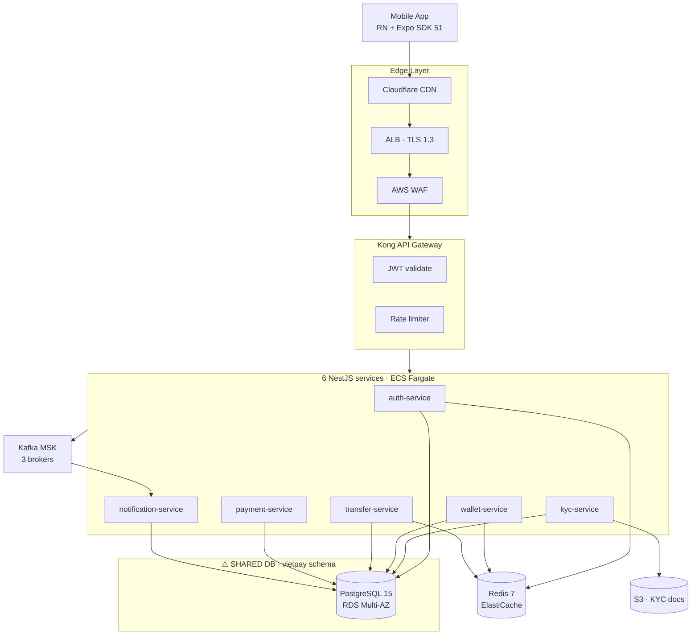
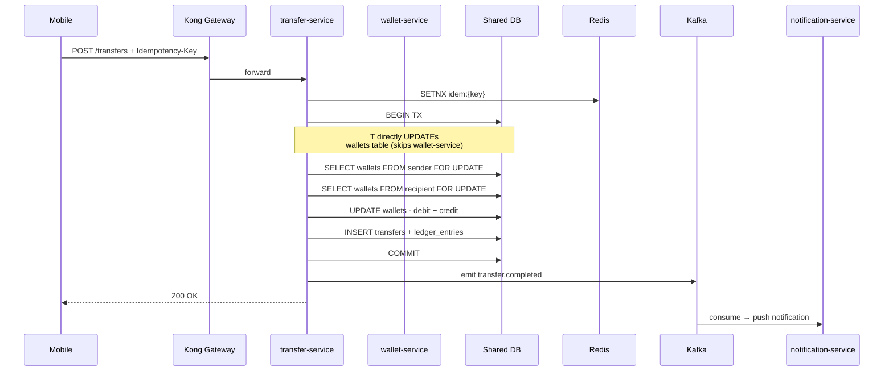

# VietPay V1 — Architecture As-Is

**Generated:** 2026-05-05 · **Source:** Reverse Engineer Agent + dependency-graph + DB introspection
**Purpose:** Baseline trước khi designing V2 — phải hiểu cái gì đang chạy trước khi đổi.

---

## 1. High-Level Topology (V1 Production)



**Key anti-pattern**: tất cả 6 services chia sẻ cùng 1 PostgreSQL schema `vietpay`. Wallet và transfer còn truy cập trực tiếp tables của nhau (bypass service boundary).

---

## 2. Service Responsibilities (Current)

| Service | Owns | Reads from others (direct DB) | Calls others (HTTP) |
|---------|------|-------------------------------|---------------------|
| auth-service | users, sessions | — | — |
| kyc-service | kyc_records, kyc_documents | users (auth) | — |
| wallet-service | wallets, ledger_entries | users (auth) | — |
| transfer-service | transfers, idempotency_keys | wallets (wallet) ⚠, users (auth) | payment-service |
| payment-service | payments, qr_codes, webhooks, linked_banks | wallets ⚠, users | sepay external |
| notification-service | notifications, prefs, device_tokens | users | — |

⚠ = violates service boundary

---

## 3. Critical Path: P2P Transfer (Current V1)



**Issue**: transfer-service **bypass** wallet-service và update bảng `wallets` trực tiếp. Lý do (legacy): wallet-service không có endpoint atomic debit+credit, nên transfer team chọn shortcut. V2 phải fix bằng cách thêm endpoint internal hoặc events.

---

## 4. Database Schema (As-Is)

Single schema `vietpay` chứa 47 tables:

```sql
-- Core auth (8 tables)
users, sessions, device_keys, otp_log, login_attempts,
password_reset_requests, account_deletion_requests, audit_users

-- KYC (5 tables)
kyc_records, kyc_documents, kyc_manual_reviews,
kyc_provider_calls, kyc_audit

-- Wallet (7 tables) -- ⚠ SHARED schema with transfer
wallets, wallet_balances_cache, ledger_entries,
wallet_freeze_log, wallet_audit, wallet_status_log,
balance_reconciliation

-- Transfer (9 tables) -- ⚠ SHARED schema with wallet
transfers, idempotency_keys, daily_limits_mv,
transfer_cancellations, transfer_failures, transfer_retries,
recipient_phone_index, transfer_audit, transfer_metrics_daily

-- Payment (8 tables)
payments, qr_codes, webhooks, linked_banks,
pending_verifications, topups, withdrawals, payment_audit

-- Notification (4 tables)
notifications, notification_preferences,
device_tokens, notification_delivery_log

-- Audit / shared (6 tables)
audit_log_partitioned, feature_flags, system_events,
ip_geolocation_cache, error_log, deploy_log
```

**Foreign keys**: 64 total. Cross-domain FKs (anti-pattern, V2 sẽ remove): 12.

**Indexes**: 138. Hot indexes: `transfers(user_id, created_at DESC)`, `wallets(user_id, currency)`, `kyc_records(status, created_at)`.

---

## 5. Event Streams (Kafka)

12 active topics:

| Topic | Producer | Consumer | Partitions | Retention |
|-------|----------|----------|-----------:|-----------|
| `transfer.created` | transfer-service | notification, audit | 6 | 7d |
| `transfer.completed` | transfer-service | notification, audit, analytics | 6 | 7d |
| `transfer.cancelled` | transfer-service | notification, audit | 3 | 7d |
| `transfer.failed` | transfer-service | notification, audit, oncall-alert | 3 | 30d |
| `topup.completed` | payment-service | wallet-service, notification | 6 | 7d |
| `payment.qr.scanned` | payment-service | analytics | 3 | 7d |
| `payment.webhook.received` | payment-service | audit | 3 | 30d |
| `kyc.completed` | kyc-service | auth-service, notification | 3 | 7d |
| `kyc.rejected` | kyc-service | auth-service, manual-review-bot | 3 | 30d |
| `notification.requested` | all services | notification-service | 6 | 1d |
| `audit.event` | all services | audit-shipper (S3) | 6 | 30d |
| `slo.breach` | observability | oncall-alert | 1 | 90d |

---

## 6. External Integrations

| Vendor | Purpose | SLA | Backup plan |
|--------|---------|-----|-------------|
| Sepay | VietQR + bank transfer | 99.5% | None (single point of failure) |
| VNPT eKYC | OCR + liveness | 99.0% | FPT eKYC (not integrated) |
| Stringee | SMS OTP | 99.9% | Twilio (not integrated) |
| FCM | Android push | 99.95% | — |
| APNs | iOS push | 99.9% | — |

**Risk**: Sepay không có fallback. Nếu Sepay down → bank transfer + VietQR scan + topup tê liệt. V2 should add VNPay direct integration as backup cho top 5 banks.

---

## 7. Deployment Model

```
ap-southeast-1 (Singapore) — primary, all production traffic
eu-central-1 (Frankfurt) — provisioned but inactive (dormant DR)
```

**Active resources** (per region):
- VPC 10.0.0.0/16, 3 AZ
- ECS Fargate cluster `vietpay-prod`
- RDS PostgreSQL Multi-AZ (db.r6g.xlarge)
- ElastiCache Redis cluster (3 master + 3 replica)
- MSK Kafka (3 brokers)
- S3 buckets (KYC, receipts, audit log)

**Deploy cadence**: 2-3 prod deploys/week. Average lead time commit → prod: 4 hours.

---

## 8. Observability Stack

| Layer | Tool | Notes |
|-------|------|-------|
| Metrics | DataDog | RED metrics per service, cost ~$400/mo |
| Logs | DataDog logs | 30-day retention |
| Traces | DataDog APM | OpenTelemetry instrumented |
| Errors mobile | Sentry | crash-free rate 99.6% (May 2026) |
| Errors backend | Sentry | issue tracking |
| Uptime | DataDog Synthetics | 5 regions probing |
| On-call | PagerDuty | rotation Eng team, 24/7 |

**SLO dashboard** (current):
- API availability: 99.91% (target 99.9%) ✓
- p95 latency: 178ms (target <200ms) ✓
- Transaction success rate: 99.62% (target ≥99.5%) ✓
- Error budget burn: 14% (over 28 days)

---

## 9. Pain Points (mapped to V2 plan)

| As-is pain | V2 fix |
|------------|--------|
| Shared DB schema giữa wallet+transfer | Split into separate DBs · strangler fig |
| Wallet god class 814 LOC | Decompose into 4 modules <200 LOC mỗi cái |
| Transfer bypass wallet-service | Add internal HTTP endpoint atomic debit+credit |
| Sepay không có backup | Add VNPay direct cho top 5 banks |
| Refund feature chưa có | Out of V2 scope (V3 candidate) |
| 4 modules zero test coverage | Add char. tests trước khi touch |
| Bill payment + topup chưa có | Build new modules trong V2 |

---

## 10. As-Is vs To-Be (Quick Diff)

| Aspect | As-Is V1 | To-Be V2 |
|--------|---------|----------|
| Services | 6 | 8 (+ bill-payment, +topup) |
| DB schema | 1 shared | per-service (wallet, transfer, payment, ...) |
| Bill payment | ❌ | ✅ EVN, Internet, Mobile, Water |
| Mobile topup | ❌ | ✅ Viettel, Vinaphone, Mobifone |
| Sepay fallback | ❌ | ✅ VNPay backup (top 5 banks) |
| Wallet god class | 814 LOC × 1 | <200 LOC × 4 modules |
| Test coverage | 71% | 85% target |
| Multi-region | dormant DR | active-passive |

---

**Used by**:
- `docs/gap-analysis.md` (compare requirements → identify gaps)
- `plans/260505-1100-vietpay-v2/migration-plan.md` (strangler fig strategy)
- `docs/characterization-tests-spec.md` (pin behaviors before refactor)
