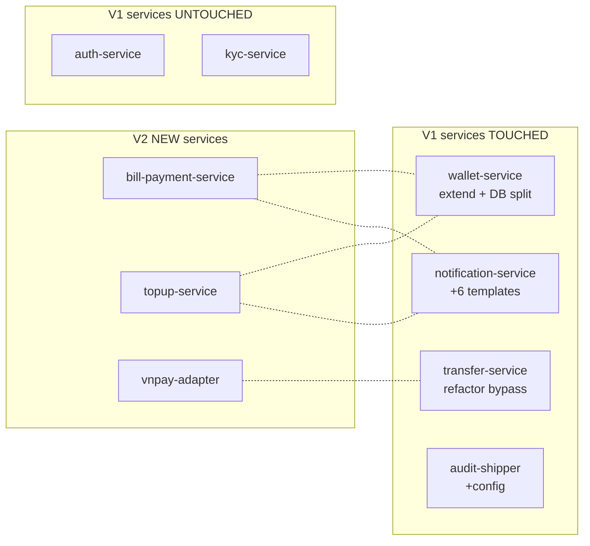

# VietPay V1 → V2 — Gap Analysis

**Generated:** 2026-05-06 · **Source:** Gap Analyzer Agent
**Inputs:** `customer-input/v2-requirements-brief.docx` + `docs/codebase-summary.md` + `docs/architecture-as-is.md`
**Status:** APPROVED by PO + Tech Lead — feed vào migration plan

---

## 1. Customer Brief (paraphrased)

> Sau 18 tháng V1 ra mắt với 312k MAU, VietPay cần V2:
> - **Bill Payment**: trả tiền điện (EVN), internet, mobile, nước. Top 4 use case từ user survey.
> - **Mobile Top-up**: nạp tiền điện thoại (Viettel, Vinaphone, Mobifone).
> - **Hạ tầng**: monolithic shared-DB cản trở scale → cần microservices DB-per-service.
> - **Volume estimate**: thêm 50k transactions/day từ bill + topup ở peak.
> - **Timeline**: launch Q3 2026 (8 tuần dev + 2 tuần beta + 2 tuần rollout).
>
> — *PO của VietPay (Linh M.), brief 2026-04-28 + Slack thread #vietpay-v2*

---

## 2. Gap Summary

| Bucket | Count | Severity |
|--------|------:|----------|
| New module | 4 | — |
| Service extension | 3 | — |
| Migration (high risk) | 2 | 🔴 Critical |
| Polish / minor | 3 | 🟢 Low |
| **Total gaps** | **12** | |

---

## 3. Gap Catalog

### 🔵 New Modules (4)

#### GAP-01 · Bill Payment Service
- **As-is**: ❌ none
- **To-be**: ✅ Service mới handle 4 providers
  - EVN (Tập đoàn điện lực) — top use case
  - Internet (FPT, Viettel, VNPT)
  - Mobile postpaid (Viettel, Vinaphone, Mobifone)
  - Nước (TP.HCM, Hà Nội, Đà Nẵng)
- **Type**: NEW MODULE
- **Risk**: Medium · phụ thuộc vào Sepay bill payment API (not yet integrated)
- **Estimate**: 3 weeks (1 backend + 1 mobile, parallel)
- **Dependencies**: Sepay bill payment API onboarding (parallel kick-off)

#### GAP-02 · Mobile Top-up Service
- **As-is**: ❌ none
- **To-be**: ✅ Top-up nạp tiền điện thoại 3 carriers (Viettel, Vinaphone, Mobifone) cho prepaid cards
- **Type**: NEW MODULE
- **Risk**: Low · Sepay đã có sẵn API top-up
- **Estimate**: 1.5 weeks
- **Dependencies**: Reuse wallet debit logic từ transfer-service

#### GAP-03 · VNPay Backup Adapter (resilience)
- **As-is**: ❌ Sepay là single point of failure
- **To-be**: ✅ VNPay direct integration cho top 5 banks (VCB, BIDV, VTB, Agribank, MB) — fallback khi Sepay down
- **Type**: NEW MODULE (adapter pattern)
- **Risk**: Low · contract test với VNPay sandbox
- **Estimate**: 1 week
- **Dependencies**: VNPay merchant onboarding (legal team handle)

#### GAP-04 · Recurring Bill Payment (out of V2 scope)
- **As-is**: ❌ none
- **To-be**: future — auto-pay monthly bills
- **Type**: BACKLOG (V3)
- **Decision**: PO confirm out of V2 scope (focus + ship sớm)

---

### 🟡 Service Extensions (3)

#### GAP-05 · Wallet Service · Add internal debit/credit endpoint
- **As-is**: transfer-service bypass wallet-service, UPDATE wallets table trực tiếp (anti-pattern)
- **To-be**: wallet-service expose internal endpoint `POST /wallets/internal/debit-credit` atomic, dùng cho cross-service operations
- **Type**: EXTENSION (new endpoint trong existing service)
- **Risk**: Medium · cần migrate transfer-service code over
- **Estimate**: 1 week (sau khi wallet-service split DB done)
- **Dependencies**: Block by GAP-08 (DB split)

#### GAP-06 · Notification Service · Add bill payment + topup templates
- **As-is**: 8 notification templates currently
- **To-be**: + 6 templates mới (bill-success, bill-failed, topup-success, topup-failed, recurring-reminder không dùng V2, bill-reminder)
- **Type**: EXTENSION
- **Risk**: Low · template engine ready
- **Estimate**: 2 days

#### GAP-07 · Audit Service · Compliance scope expansion
- **As-is**: Audit log cover transfer + topup
- **To-be**: + bill payment + VNPay calls audited theo SBV requirement
- **Type**: EXTENSION (config + ruleset)
- **Risk**: Low
- **Estimate**: 1 day

---

### 🔴 Critical Migrations (2)

#### GAP-08 · Wallet Service · Split shared DB schema
- **As-is**: `wallets`, `ledger_entries`, ... share schema `vietpay` với transfer-service
- **To-be**: Separate `wallet_db` (own RDS instance hoặc separate schema với strict access control)
- **Type**: MIGRATION 🔴 high risk
- **Strategy**: Strangler Fig + Dual Write
  - Week 1-2: Setup new wallet_db schema (mirror)
  - Week 3: Enable dual-write từ wallet-service tới both old + new DB
  - Week 4: Read traffic 5% → 25% → 100% switch sang new DB
  - Week 5: Old DB read-only · monitor 1 week
  - Week 6: Drop old wallet tables từ shared schema
- **Risk**: Data inconsistency trong dual-write window (mitigation: hourly consistency checker job + alarm)
- **Estimate**: 6 weeks (longest critical path item)
- **Affected MAU**: ALL 312k

#### GAP-09 · Transfer Service · Stop bypassing wallet-service
- **As-is**: transfer-service updates `wallets` table trực tiếp (line 67-89 in `transfer.service.ts`)
- **To-be**: transfer-service gọi `wallet-service.internalDebitCredit()` qua HTTP nội bộ
- **Type**: MIGRATION (refactor critical path)
- **Risk**: 🔴 Critical · transfer hot path (~78k tx/day) — bug = lost money
- **Strategy**: Char. tests pin existing behavior → refactor → A/B 1% → 100%
- **Estimate**: 2 weeks (after GAP-05 + GAP-08 done)
- **Dependencies**: Blocked by GAP-05 + GAP-08

---

### 🟢 Polish / Minor (3)

#### GAP-10 · Mobile UX · Bill payment quick-pick
- **As-is**: User type lại mã bill mỗi lần
- **To-be**: Save recent bills (last 5), quick-pay button
- **Type**: UX enhancement
- **Estimate**: 3 days

#### GAP-11 · Outdated dependencies
- **As-is**: 23 outdated packages, 4 với CVE high
- **To-be**: All up to date
- **Type**: MAINTENANCE
- **Risk**: Low (semver-compatible upgrades)
- **Estimate**: 2 days

#### GAP-12 · DataDog dashboard for V2 metrics
- **As-is**: V1 metrics covered
- **To-be**: + bill payment success rate · topup latency · VNPay fallback rate
- **Type**: OBSERVABILITY
- **Estimate**: 1 day

---

## 4. Change Impact Map

**Endpoints affected**: 23 (mostly new endpoints in new services + 4 modified in existing).
**DB tables migrated**: 8 (wallet schema). New tables: 11 (bill-payment + topup + audit extensions).
**Mobile screens new/modified**: 14 new + 6 modified.

---

## 5. Effort Estimate Summary

| Workstream | Estimate | Dependencies |
|------------|----------|--------------|
| Char. tests V1 hot path (pre-refactor) | 1.5 weeks | independent |
| GAP-08 Wallet DB split (strangler) | 6 weeks | none (kick off Day 1) |
| GAP-05 Wallet internal endpoint | 1 week | after GAP-08 W3 |
| GAP-09 Transfer refactor bypass | 2 weeks | after GAP-05 |
| GAP-01 Bill payment service | 3 weeks | parallel · Sepay onboarding |
| GAP-02 Topup service | 1.5 weeks | parallel · after GAP-05 |
| GAP-03 VNPay backup | 1 week | parallel |
| GAP-06 Notification templates | 2 days | parallel |
| GAP-07 Audit extension | 1 day | parallel |
| GAP-10/11/12 Polish | 1 week | end |

**Critical path** (longest dependency chain): Char. tests → GAP-08 → GAP-05 → GAP-09 = ~10 weeks
**Customer ask**: 8 weeks dev + 2 beta + 2 rollout

**Verdict**: timeline tight nhưng feasible nếu parallel work tốt. Risk buffer 1 week.

---

## 6. Out of V2 Scope (PO confirmed)

- Refund feature (V3 candidate)
- Recurring bill auto-pay (V3)
- Investment products
- Multi-currency
- Web app
- Multi-region active-active

---

## 7. Open Questions Resolved

12 ambiguities clarified với PO trong workshop 2026-05-04:

1. ✅ "Bill payment" → 4 specific providers (EVN, Internet, Mobile postpaid, Water)
2. ✅ Daily limit cho bill: 20M VND/lần (vs P2P 10M)
3. ✅ Topup max: 500k VND/lần, 5M/ngày
4. ✅ VNPay fallback chỉ cho top 5 banks (cost reason)
5. ✅ Recurring bill: NOT in V2
6. ✅ Bill payment fee: free for users (VietPay absorb cost)
7. ✅ Topup fee: free
8. ✅ Bill payment success notification: cả push + email
9. ✅ Customer SME (PO Linh M.) sẽ joint final review
10. ✅ Beta tester pool: 1000 internal users + 500 selected V1 users
11. ✅ Rollout: canary 5/25/50/100 with 4-stage SLO check
12. ✅ Hyper-care: 72h on-call after 100% rollout

---

## 8. Risks Surfaced

| Risk | Severity | Mitigation | Owner |
|------|:--------:|------------|-------|
| Wallet DB split fails consistency check | 🔴 Critical | Hourly checker + alarm + dual-write window 1 week | Tech Lead |
| Transfer refactor breaks hot path | 🔴 Critical | Char. tests pin V1 behavior + canary 1% → 100% | Backend Lead |
| Sepay bill payment API delay | 🟡 High | Negotiate timeline + fallback to direct API | PM |
| VNPay onboarding legal delay | 🟡 High | Start legal Day 1, parallel work | Legal + PM |
| Beta user negative feedback bill UX | 🟢 Medium | Iterate after beta week 1 | Mobile Lead |
| Customer SME unavailable for review | 🟢 Medium | Pre-schedule SME slots, async review fallback | PM |

---

**Sign-off**:
- ✅ Customer SME (Linh M., PO) — 2026-05-06
- ✅ Tech Lead (Long N.) — 2026-05-06
- ✅ Compliance (Trang H.) — 2026-05-06

→ Feed vào `plans/260505-1100-vietpay-v2/migration-plan.md` (Step 03 Migration Plan + Human Gate)
