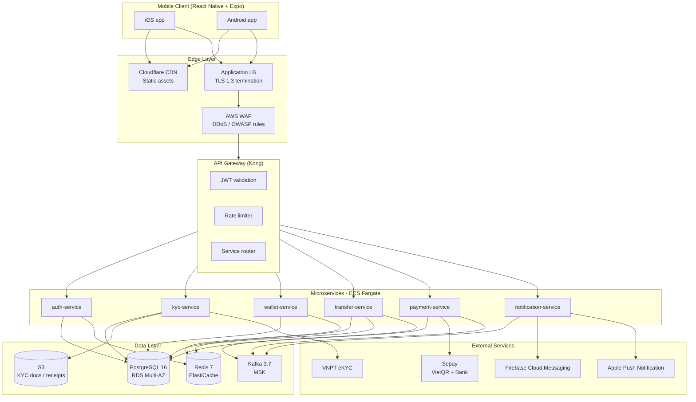
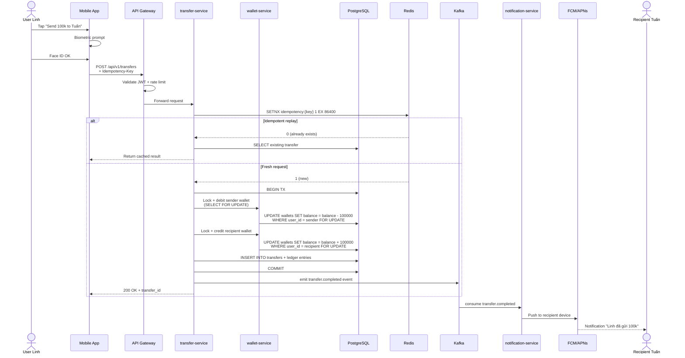

# VietPay — System Architecture

**Version:** 1.0 · **Date:** 2026-05-02 · **Author:** Planner Agent
**Status:** Approved by Eng Lead

---

## 1. High-Level Architecture



---

## 2. Service Responsibilities

| Service | Responsibility | Owns Data |
|---------|----------------|-----------|
| **auth-service** | OTP send/verify, JWT issue, session mgmt, biometric enrollment, PIN | `users`, `sessions`, `device_keys` |
| **kyc-service** | eKYC flow, OCR + liveness, manual review queue, document storage | `kyc_records`, `kyc_documents` (S3) |
| **wallet-service** | Wallet CRUD, balance lookup, double-entry ledger | `wallets`, `wallet_balances` |
| **transfer-service** | P2P transfer logic, idempotency, ledger entries, daily limit checks | `transfers`, `idempotency_keys` |
| **payment-service** | Sepay integration, VietQR generate/parse, bank webhook receiver | `payments`, `qr_codes`, `webhooks` |
| **notification-service** | Push notification (FCM/APNs), in-app inbox, preferences | `notifications`, `notification_prefs` |

**Pattern:** Database-per-service. No shared DB schemas. Cross-service queries via API or events.

---

## 3. Communication Patterns

### 3.1 Synchronous (REST)
- Client → API Gateway → Service (HTTPS / TLS 1.3)
- Service → Service via internal mTLS within VPC

### 3.2 Asynchronous (Kafka)
**Event topics:**
- `transfer.created` — emitted by transfer-service after debit+credit committed
- `transfer.completed` — emitted after settlement confirmed (cho recipient)
- `payment.qr.scanned` — emitted khi user scan VietQR
- `payment.webhook.received` — Sepay webhook
- `notification.requested` — request push notification (consumed bởi notification-service)
- `kyc.completed` — sau khi eKYC pass
- `kyc.rejected` — sau khi eKYC fail (cho manual review)

**Consumer:** mỗi service consume topic relevant. At-least-once delivery, dedup tại consumer side.

---

## 4. Data Flow — P2P Transfer (Critical Path)



**Latency budget:**
- Mobile → Gateway: 30ms
- Gateway → transfer-service: 5ms
- Idempotency check (Redis): 2ms
- DB transaction (debit + credit + insert): 30ms
- Kafka emit: 10ms
- Total: ~80-100ms p50, target < 200ms p95

---

## 5. Database Schema (high-level)

### auth-service
```sql
users (id PK, phone UNIQUE, pin_hash, kyc_status, created_at, ...)
sessions (id PK, user_id FK, refresh_token_hash, device_id, expires_at, ...)
device_keys (id PK, user_id FK, public_key, biometric_enabled, ...)
```

### kyc-service
```sql
kyc_records (id PK, user_id, status [pending|approved|rejected|manual], confidence, ...)
kyc_documents (id PK, kyc_id FK, type [cmnd_front|cmnd_back|selfie], s3_key, ...)
```

### wallet-service
```sql
wallets (id PK, user_id FK, currency CHAR(3), balance BIGINT CHECK >=0, status, ...)
ledger_entries (id PK, wallet_id FK, transaction_id, amount, direction [debit|credit], ...)
```

### transfer-service
```sql
transfers (id PK, from_user, to_user, amount, currency, status, idem_key UNIQUE, ...)
idempotency_keys (key PK, response_body JSONB, created_at, expires_at)
```

### payment-service
```sql
payments (id PK, user_id, type [topup|withdraw|qr], amount, sepay_ref, status, ...)
qr_codes (id PK, user_id, type [static|dynamic], amount, expires_at, qr_string, ...)
webhooks (id PK, source [sepay|vnpay], payload JSONB, signature, processed_at, ...)
```

### notification-service
```sql
notifications (id PK, user_id, type, title, body, data JSONB, read_at, ...)
notification_prefs (user_id PK, transfer_in BOOL, transfer_out BOOL, security BOOL, ...)
```

**Indexes:** `(user_id, created_at DESC)` cho time-series queries. Cursor pagination, no OFFSET.

---

## 6. Caching Strategy

| Cache | Key | TTL | Invalidation |
|-------|-----|-----|--------------|
| Wallet balance | `wallet:{user_id}` | 30s | Invalidate on transfer / topup |
| User profile | `user:{id}` | 5 min | Invalidate on profile update |
| Bank list | `banks:vn` | 1 hour | Manual on bank list update |
| Idempotency key | `idem:{key}` | 24 hour | Auto-expire |
| Rate limit window | `rl:{user}:{endpoint}` | 1 min | Auto-expire |
| OTP code | `otp:{phone}` | 5 min | Auto-expire / one-time use |

**Redis cluster:** 3 master + 3 replica, sentinel for failover.

---

## 7. Security Architecture

### 7.1 Defense in depth
```
[Cloudflare CDN + DDoS]
        ↓
[AWS WAF — OWASP rules + custom]
        ↓
[ALB — TLS 1.3 termination]
        ↓
[VPC private subnet — services]
        ↓
[Database / Redis — security groups, no public access]
```

### 7.2 Authentication
- JWT access token (15 min) + refresh token (30 day rolling)
- Refresh token rotation on every use, revoke chain on suspected theft
- Device binding via public/private keypair generated at enroll

### 7.3 Encryption
- **At rest:** AES-256-GCM (DB + S3 + Redis snapshots) via AWS KMS
- **In transit:** TLS 1.3 client-server, mTLS service-to-service
- **PII fields:** column-level encryption (Postgres pgcrypto)
- **KYC docs:** S3 + KMS + object lock (5-year retention per SBV)

### 7.4 Secrets management
- AWS Secrets Manager for credentials
- KMS-encrypted env files in S3
- No secrets in code / git / container images
- Rotation: DB password 90 days, API keys per vendor SLA

---

## 8. Observability

| Layer | Tool | Purpose |
|-------|------|---------|
| Metrics | DataDog | RED metrics (Rate, Errors, Duration) per service |
| Logs | DataDog logs | Structured JSON, 30-day retention |
| Traces | DataDog APM | Distributed tracing via OpenTelemetry |
| Errors | Sentry | Crash reports, mobile + backend |
| Uptime | DataDog Synthetics | Endpoint probes from 5 regions |
| Alerts | PagerDuty | On-call rotation, severity 1-4 |

**SLO dashboard:**
- Service availability (99.9% target)
- API latency p50/p95/p99
- Error budget burn rate
- Transaction success rate (≥ 99.5% target)

---

## 9. Deployment Topology

### 9.1 Regions
- **Primary:** `ap-southeast-1` (Singapore) — serve VN users (low latency ~30ms Saigon-Singapore)
- **Secondary:** `eu-central-1` (Frankfurt) — serve EU expat / DR backup

### 9.2 Per-region stack
```
VPC (10.0.0.0/16)
├── Public subnet — ALB, NAT GW
├── Private subnet (3 AZs)
│   ├── ECS Fargate tasks (auto-scaling 2-20)
│   ├── RDS PostgreSQL Multi-AZ
│   ├── ElastiCache Redis cluster
│   └── MSK Kafka brokers (3 nodes)
└── Isolated subnet — Secrets Manager VPC endpoint
```

### 9.3 CI/CD
- **Source:** GitHub
- **CI:** GitHub Actions — lint, test, build container image, push to ECR
- **CD:** AWS CodeDeploy → ECS blue/green
- **Mobile:** Expo EAS → TestFlight (iOS) + Play Store internal track (Android)
- **Approval gate:** PR requires 2 reviewers + passing CI + manual QA sign-off cho production deploy

---

## 10. Disaster Recovery

| Scenario | Strategy | RTO | RPO |
|----------|----------|-----|-----|
| Single AZ failure | Multi-AZ RDS auto-failover, ECS reschedule | < 5 min | < 1 min |
| Regional failure | Promote eu-central-1, DNS failover (Route 53) | < 30 min | < 5 min |
| Database corruption | Point-in-time restore (PITR) | < 1 hour | < 5 min |
| Sepay outage | Queue requests, retry with exponential backoff, user notification | N/A | 0 |
| Compromised credentials | KMS key rotation, force logout all sessions | < 15 min | 0 |

**Backup:**
- RDS automated backup, 35-day retention
- S3 cross-region replication (KYC docs)
- Database snapshot daily, encrypted, 1-year retention

---

## 11. Cost Estimate (monthly, 50k MAU)

| Resource | Cost (USD) |
|----------|-----------|
| ECS Fargate (12 tasks avg) | $850 |
| RDS PostgreSQL Multi-AZ (db.r6g.xlarge) | $720 |
| ElastiCache Redis (cache.r6g.large × 3) | $540 |
| MSK Kafka (kafka.m5.large × 3) | $480 |
| S3 + CloudFront | $180 |
| DataDog | $400 |
| Sepay fees (~50k txn) | $250 |
| VNPT eKYC (~2k new users) | $100 |
| Cloudflare | $50 |
| **Total** | **~$3,570** |

Scaling estimate: ~$0.07 / MAU / month at this size, drop tới ~$0.04 ở 500k MAU scale.

---

## 12. Scaling Plan

| Stage | MAU | Action |
|-------|-----|--------|
| MVP launch | 0-10k | Single region, baseline infra |
| Growth | 10k-100k | Auto-scaling kicks in, add read replica |
| Scale-up | 100k-500k | Add eu-central-1 active, sharding readiness |
| Mass | 500k-1M+ | Database sharding by user_id, Kafka cluster scale |

---

## Open Questions

- Có cần multi-region active-active cho VN traffic không, hay primary-only ap-southeast-1 đủ tới 1M MAU?
- Sharding strategy: user_id hash vs geographic? (decide ở 200k MAU)
- Cost optimization: chuyển từ DataDog sang self-hosted Grafana + Loki + Tempo ở scale 500k?
